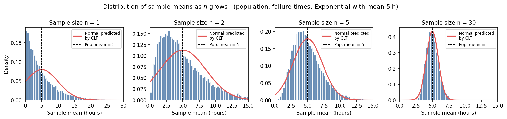
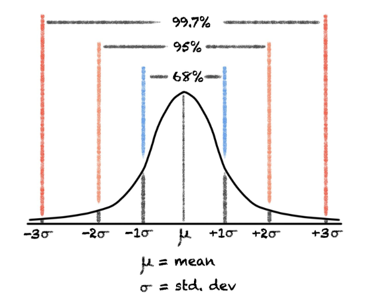

# 🛠️ Worked Example: The Central Limit Theorem

So now we know the difference between the **population** (everything we care about - usually NOT measurable) and the **sample** (the small set of measurements we actually have). Since we can't measure the whole population, we wouldn't know the *true* mean, what we can do instead is to use the sample mean $\bar{x}$ as our best guess of the unknown population mean $\mu$.

But wait, surely that's not accurate - we can't use the sample mean $\bar{x}$ to replace the population mean $\mu$. But, if you think about it, if your sample gets larger and larger $\bar{x}$ would get closer and closer to the population mean $\mu$. But a very small sample size may deviate more from the actual $\mu$. 

So, the questions now become, 

>How big should the sample size be for us to estimate the population mean with some certainty?  

> If I take **a different sample**, I'll get a **different** sample mean. So how trustworthy is *any one* sample mean? Could it be completely off?

This is one of the most important questions in all of statistics - and the answer is given by the **Central Limit Theorem** (CLT). It is also one of the most surprising results in science, so it is worth slowing down to see it in action.

---

## 1. The claim 

```{admonition} The Central Limit Theorem (in plain English)
:class: important
Take any population - it can have any shape at all (skewed, lumpy, discrete, ugly). Repeatedly draw samples of size n from it and compute the **mean** of each sample.

As n grows, the distribution of those **sample means** looks more and more like a **bell curve** (a normal distribution) - *regardless of what the original population looked like*.

Specifically, the sample means cluster around the true population mean μ, with a spread that **shrinks** as n grows:

$$
\text{spread of sample means} \;=\; \frac{\sigma}{\sqrt{n}}
$$

where σ is the population standard deviation.
```

Two pieces to note:

1. **The shape becomes normal even when the original data isn't.** This is the magic of the CLT. The bell curve is not assumed - it *emerges*.
2. **The spread shrinks as $\sqrt{n}$.** Bigger samples give more reliable means. To halve your uncertainty, you need *four times* as much data - not twice.

We're going to see both of these happen with our own eyes, and once you understand this concept, you'll be able to answer the earlier questions on sample size.

---

## 2. The setup: failure times of a material 🫖

Suppose we are stress-testing a new ceramic and recording how many **hours each specimen lasts before it fractures**. Failure times like these are famously **right-skewed**: lots of specimens fail early, a few survive much longer. The bell-curve shape *does not apply* to the raw failure times.

For this example let's imagine we are working with a population where the **true population mean is $\mu = 5$ hours** and the **true population standard deviation is $\sigma = 5$ hours**. But of course, we wouldn't know these values while we are setting up the experiment (These values come from a so-called *exponential* distribution - the details aren't important; what matters is that the shape looks nothing like a bell.)

While setting things up, we can wonder 🤔 how mnay samples do we need to test in order to get a good statistical estimate of the actual mean?

```{admonition} Problem
:class: note
To answer the above, we are going to run a thought experiment 🤔💭. Imaging we repeat the following procedure many thousands of times:

> If we could *"Draw n failure times from the population, compute their sample mean $\bar{x}$, write it down."*

This gives us a whole collection of sample means $(\bar{x_1},\bar{x_2},\bar{x_3}\dots\bar{x_n}$. 

According to the CLT, that collection of $\bar{x}$'s should look more and more like a bell curve as n grows, centred at μ=5, with spread $σ/\sqrt{n}=5/\sqrt{n}$.

So if that were true, you can fill in the predictions for sample spread $σ/\sqrt{n}$:

| Sample size n | Predicted centre of the bell | Predicted spread $σ/\sqrt{n}$ |
|---|---|---|
| 1   | ? | ? |
| 2   | ? | ? |
| 5   | ? | ? |
| 30  | ? | ? |
```

```{admonition} Show solution
:class: dropdown

The centre is **always μ=5 hours**, no matter what n is. Only the spread changes:

| Sample size n | Centre | Spread $σ/\sqrt{n} =5/\sqrt{n}$ |
|---|---|---|
| 1   | 5 | 5/1=5.00 |
| 2   | 5 | 5/2≈3.54 |
| 5   | 5 | 5/5≈2.24 |
| 30  | 5 | 5/30≈0.91 |

So the CLT predicts: as n grows from 1 to 30, the cloud of sample means stays centred on 5 hours but **tightens** from a spread of 5 hours down to about 0.91 hours. That's a factor of roughly 30≈5.5× tighter.
```

---

## 3. Now let's actually do it 

We are going to draw samples from the population according to the earlier table. But each sample size we will re-draw (randomly) multiple times - 20,000 to be exact. 

So we start with drawing 1 sample - record their mean (which is the value of that material), and then draw another 1 sample, and another until we've drawn 20,000 samples and recorded their values.

Next we are moving on to sample size two. Now we will draw two samples at a time - record the mean value of their failure time, and then re-draw another 2 samples etc.

Next we draw 5 samples at a time, record their sample mean, then re-draw another 5 samples and record their means until we've got 20,000 mean values.

Similarly we will draw a set of 30 ceramic samples, record their mean failure time, and then re-draw another 30 ceramic samples and keep going until we have 20,000 recorded values. 

Below, each panel shows what happens when we draw 20,000 samples of size $n$, compute the mean of each, and histogram those 20,000 means. The red curve is the bell curve the CLT *predicts* - centre at 5, spread $5/\sqrt{n}$.




The **distribution of sample means** as the sample size $n$ grows. The underlying population (failure times) is right-skewed and looks nothing like a bell - yet by $n=30$, the distribution of sample means is essentially indistinguishable from the bell curve predicted by the CLT (red).


Look carefully at each panel:👀

- **$n = 1$** - A "sample of size 1" is just a single measurement, so this panel is really just showing the population itself. It is steeply right-skewed, with most failures happening early. *No bell anywhere.* In fact the red CLT-predicted bell is clearly wrong here: if you extend the bell-shape towards and beyond zero, it even puts probability below 0 hours, which is impossible for a failure time. **Bottom line:** at $n=1$ the CLT has not "kicked in" yet.

- **$n = 2$** - Averaging just two measurements already pulls the histogram inward. It is still skewed, but a hump is appearing near 5.

- **$n = 5$** - Now the shape is recognisably bell-ish, peaked at the population mean of 5, with only a faint right-skew remaining. The red CLT prediction is a noticeably better fit.

- **$n = 30$** - The histogram and the red curve are **on top of each other**. The CLT is now an excellent description of how sample means behave, even though the underlying data is wildly non-normal.

```{admonition} Verifying the prediction numerically
:class: tip
Comparing what we *predicted* with $σ/\sqrt{n}$ to what the simulation *actually produced*:

| n | Predicted spread | Observed spread of sample means |
|---|---|---|
| 1  | 5.00 | 5.04 |
| 2  | 3.54 | 3.54 |
| 5  | 2.24 | 2.24 |
| 30 | 0.91 | 0.92 |

The CLT formula actually predicted the spread of the sample means to within a fraction of a percent. *(These observed values come from the simulation that produced the figure above.)*

---

OK, now let's finish our thought experiment and come back to our real experiment - how many ceramic peices should we test (sample size) for us to estimate the population mean accurately?

## 4. The "n is large enough" rule of thumb

A natural question: **how large does n have to be** before the bell curve is a good approximation?

There is no exact answer - it depends on how non-normal the population is. A common rule of thumb you will see in textbooks is:

> **If n≥30, the distribution of the sample mean is usually close enough to normal for practical purposes.**

This is a guideline, not a law. If the population is *already* roughly bell-shaped, much smaller n is fine. If the population is *extremely* skewed or has heavy tails, you may need much more than 30. In our exponential example, n=30 already does a great job, as the figure shows.

---

## 5. Why this is so useful: the standard error of the mean

The CLT gives us a name and a formula for the spread of the sample mean. We call it the **standard error of the mean**:

$$
\text{SE}(\bar{x}) \;=\; \frac{\sigma}{\sqrt{n}}
$$

This is the quantity that tells us *how uncertain our sample mean is as an estimate of the t.rue population mean.*

So, if our sample size was just 1 - we are very uncertain if our mean value (sample mean) represents the true population mean. But as our sample size increases our uncertainty value decreases and we can be more confident that our sample mean approximates the true population mean.

```{admonition} Problem
:class: note
You measure the failure times of n=25 ceramic specimens and find a sample mean of $\bar{x}=4.6$ hours. Assume the population standard deviation is known to be σ=5 hours.

What is the standard error of your sample mean?
```

```{admonition} Show solution
:class: dropdown

$$
\text{SE}(\bar{x}) = \frac{\sigma}{\sqrt{n}} = \frac{5}{\sqrt{25}} = \frac{5}{5} = 1 \ \text{hour}
$$

So although our best estimate of the population mean is 4.6 hours, we know that this estimate has a typical uncertainty of about **1 hour**. Because the CLT tells us $\bar{x}$ is approximately normally distributed around μ, we can even say something stronger:

- about **68%** of the time, $\bar{x}$ falls within 1 SE of μ → μ is likely within roughly 4.6±1 hour
- about **95%** of the time, within 2 SE → μ is likely within roughly 4.6±2 hours

The 68% and 95% values stem from the standard normal distribution 



This is the engine behind **confidence intervals**.
```

```{admonition} The square-root law in practice 
:class: warning
Because SE shrinks as σ/n, **doubling your precision requires quadrupling your sample size**.

- Going from n=25 to n=100 → halves the SE (5 → 2.5… wait, 5/25=1 and 5/100=0.5, so SE goes from 1 to 0.5). ✓
- Going from n=100 to n=10000 → reduces SE by a factor of 10.

There is no cheap way around this. The CLT is *generous* (it works on any population) but *strict* about the price of precision.
```

---

## 6. Why this matters for machine learning

The CLT is the reason a lot of machine learning *works*:

- **Training metrics are sample means.** When we report a model's "accuracy on the test set" or "mean squared error", we are reporting a sample mean. The CLT tells us how uncertain that number is - and how much test data we need before we can trust it.
- **Comparing two models** boils down to comparing two sample means. The CLT lets us judge whether the difference is real or just sampling noise.
- **Cross-validation** averages performance across folds. The CLT explains why averaging stabilises the estimate.
- **Standard error bars** on every plot you'll ever see in an ML paper are an application of $\sigma/\sqrt{n}$.

Whenever you see error bars, confidence intervals, or "is this improvement statistically significant?", the CLT is quietly doing the work in the background.

---

## 7. Summary 📋

```{admonition} What to remember
:class: important
- **What the CLT says:** sample means become **normally distributed** as n grows, *regardless of the shape of the underlying population*.
- **Centre:** the population mean μ.
- **Spread:** the **standard error**, σ/n.
- **Rule of thumb:** n≥30 is usually enough.
- **The price of precision:** to halve the SE, you need **4×** the data.
- **Why we care:** the CLT is what makes a single sample mean *trustworthy* as a stand-in for the unknown population mean - and it's the foundation of confidence intervals, hypothesis tests, and most uncertainty quantification you'll see in ML.
```

Standard deviation (s) describes how spread out the individual measurements are. If you report $\bar{x} ± s$, you're saying "here's how much any single ceramic specimen's failure time tends to vary from the average." This number does not shrink as you test more specimens - testing 1000 pieces instead of 25 won't make the ceramic itself less variable.

Standard error $(SE = s/\sqrt{n})$ describes how uncertain your estimate of the mean is. If you report $\bar{x} ± SE$, you're saying "here's how much my estimate of the true population mean would bounce around if I repeated this experiment." This number does shrink as n grows, because more data gives you a more precise estimate of μ, even though the material itself is exactly as variable as before.

---

## 8. Reproduce it yourself (optional)

If you want to play with the simulation - try a different population shape, a different sample size, or a different number of repeats - the entire figure can be reproduced with a short Python snippet:

Just open up a new Python script and copy (or write out) the following code, then run. You can change the parameters to see how they affect the outcome.

```{code-cell} python3
import numpy as np
import matplotlib.pyplot as plt
import math

rng = np.random.default_rng(seed=7)

# ---- Pick a population shape here - the only line that needs changing ----
DIST_NAME = "poisson"   # try: "exponential" | "uniform" | "lognormal" | "weibull" | "gamma" | "poisson".

#We need to specify mean and standard deviation for the distribution that is in use
#Each distribution requires different parameters:

DISTRIBUTIONS = {
    "exponential": {
        "sampler": lambda rng, size: rng.exponential(scale=5.0, size=size),
        "mean":    lambda: 5.0,
        "std":     lambda: 5.0,
    },
    "uniform": {
        "sampler": lambda rng, size: rng.uniform(0.0, 10.0, size=size),
        "mean":    lambda: (0.0 + 10.0) / 2,
        "std":     lambda: (10.0 - 0.0) / np.sqrt(12),
    },
    "lognormal": {
        "sampler": lambda rng, size: rng.lognormal(mean=1.3, sigma=0.5, size=size),
        "mean":    lambda: np.exp(1.3 + 0.5**2 / 2),
        "std":     lambda: np.sqrt((np.exp(0.5**2) - 1) * np.exp(2*1.3 + 0.5**2)),
    },
    "weibull": {
        "sampler": lambda rng, size: 5.0 * rng.weibull(1.5, size=size),
        "mean":    lambda: 5.0 * math.gamma(1 + 1/1.5),
        "std":     lambda: 5.0 * np.sqrt(math.gamma(1 + 2/1.5) - math.gamma(1 + 1/1.5)**2),
    },
    "gamma": {
        "sampler": lambda rng, size: rng.gamma(shape=2.0, scale=2.5, size=size),
        "mean":    lambda: 2.0 * 2.5,
        "std":     lambda: 2.5 * np.sqrt(2.0),
    },
    "poisson": {
        "sampler": lambda rng, size: rng.poisson(lam=4.0, size=size),
        "mean":    lambda: 4.0,
        "std":     lambda: np.sqrt(4.0),
    },
}

spec = DISTRIBUTIONS[DIST_NAME]  #python picks up the parameters depending on the DIST_NAME
population = spec["sampler"](rng, 500_000)
mu, sigma = spec["mean"](), spec["std"]()
# --------------------------------------------------------------------------------

#Next we plot

fig, axes = plt.subplots(1, 4, figsize=(14, 3.3))
for ax, n in zip(axes, [1, 2, 5, 30]):
    sample_means = rng.choice(population, size=(20_000, n), replace=True).mean(axis=1)

    se = sigma / np.sqrt(n)
    lo, hi = max(0.0, mu - 6*se), mu + 6*se   # auto-sized window, no hardcoded xmax

    ax.hist(sample_means, bins=60, density=True, range=(lo, hi),
             color="#4C78A8", edgecolor="white", alpha=0.85)

    xs = np.linspace(lo, hi, 400)
    pdf = (1/(se*np.sqrt(2*np.pi))) * np.exp(-0.5*((xs - mu)/se)**2)
    ax.plot(xs, pdf, color="#E45756", lw=2)

    ax.axvline(mu, color="black", linestyle="--", linewidth=1)
    ax.set_title(f"n = {n}")
    ax.set_xlabel("Sample mean (hours)")

plt.tight_layout()
plt.show()


```

```{admonition} Try this
:class: tip
- Change the source distribution (DIST_NAME) and try out the various distributions given alongside - does it still become bell-shaped?
```
