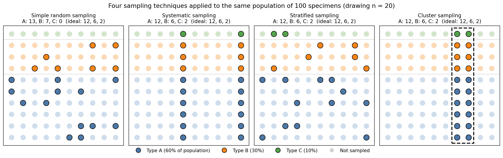

# Sampling Techniques
🍎🍎🍏🍎🍏🍏🍎
## 1. Introduction

The Central Limit Theorem we just met has a powerful promise:

> *Take any population, draw a large enough sample, and the sample mean $\bar{x}$ will be a reliable estimate of the population mean $\mu$.*

But that promise comes with quiet fine print: the CLT assumes that our sample is drawn in a way that fairly represents the population. If the way we *collect* our data is biased, then **no amount of clever statistics can fix it later**. A bad sample produces a confident, well-quantified, completely wrong answer.

This is why the *method* by which we choose what to measure matters so much. **Sampling techniques** are the recipes for picking which items in a population we will actually look at. Choosing the right one for the situation is one of the most important - and most overlooked - steps in any data-driven study.

A few familiar settings where this comes up:

- A **polling company** wants to estimate how the whole country will vote without asking every voter.
- A **quality control engineer** wants to know the average tensile strength of a million-rod production batch without testing every rod.
- A **materials scientist** wants to know the grain size of a new alloy without exhaustively imaging every square micrometre of it.

In every case, the population is too big to measure completely, so we need a smart way to **pick a manageable subset that still tells us the truth about the whole**.

---

## 🎲 2. Probability vs non-probability sampling

Before looking at specific methods, it helps to know the big split.

```{admonition} Two families of sampling
:class: important
- **Probability sampling**: every member of the population has a *known, non-zero* chance of being chosen. This is what allows the CLT, standard errors, and confidence intervals to work properly.
- **Non-probability sampling**: items are chosen for convenience, judgement, or accessibility. Easier, but the resulting statistics can be *systematically* (not just randomly) wrong.
```

Methods 3-7 below are all probability methods. Method 8 (convenience sampling) is a non-probability method, included because it's how people often sample by default - and because understanding *why* it goes wrong is just as important as knowing the correct methods.

---

## 3. Simple Random Sampling (SRS)

The most basic - and most often misunderstood - method. In a simple random sample, **every member of the population is equally likely to be chosen**, and each draw is independent of the others.

**How to do it (in practice):**
1. Assign every item in the population a unique number, from 1 to $N$.
2. Use a random number generator (or a random number table, or - historically - a lottery drum) to pick $n$ of those numbers.
3. Measure the corresponding items.

**Examples:**

- *General:* A lecturer with 200 students wants to interview 20 of them about a course. She numbers her class list 1-200 and uses Python's `random.sample(range(1, 201), 20)` to pick the 20.
- *Materials:* A manufacturing line produces 10,000 ceramic tiles per day. To estimate the mean breaking strength of the day's output, an engineer numbers each tile and randomly selects 50 for destructive testing.

**Why it's good:** It's *unbiased by construction*. Every item has the same chance of being chosen, so on average the sample mirrors the population.

**Where it falls short:** Pure chance can still produce **unlucky samples** - especially when an important subgroup is small. If only 10% of your population is "Type C," a small simple random sample might miss Type C entirely. We'll see this happen in §9.

---

## 4. Systematic Sampling

Order the population in some sequence, pick a random starting point, then take **every $k$-th item** after that.

The interval is usually chosen as $k = N/n$, where $N$ is the population size and $n$ is the desired sample size.

**How to do it:**
1. Arrange the population in a line (by serial number, time of arrival, position along a strip, etc.).
2. Pick a random starting index between 1 and $k$.
3. Take that item, then every $k$-th one after it.

**Examples:**

- *General:* A market researcher stands at a supermarket entrance and surveys every 20th customer. With ~2000 customers per day and a target of 100 responses, $k = 20$.
- *Materials:* A roll of steel sheet is 100 m long. To check thickness uniformity, an inspector measures every 1 m along the length. If the roll is the entire population of interest, that's a systematic sample of 100 readings.

**Why it's good:** Easy to organise, and it forces an **even spread** through the population - which is sometimes more representative than a simple random draw.

**Where it falls short:** It fails badly if there's a *hidden periodicity* in the population that matches the sampling interval. If you sampled every 4th house in a row of houses, and every 4th house happened to be a corner house (with a larger garden), you'd systematically overestimate the average garden size. In materials science, watch out for periodic patterns in production processes that could align with the sampling step.

---

## 5. Stratified Sampling

When the population naturally divides into **distinct subgroups** (called *strata*) that you care about - like alloy types, manufacturing batches, particle size classes, or sample-prep dates - stratified sampling makes sure each subgroup is represented.

**How to do it:**
1. Split the population into non-overlapping strata that cover everyone.
2. Draw a separate simple random sample **from each stratum**.
3. Usually the size of each per-stratum sample is **proportional** to the size of that stratum in the population.

```{admonition} Worked example: proportional allocation
:class: note
A foundry produces three alloy variants, mixed together in a batch of N=1000 rods:

- 600 rods of **Alloy A**
- 300 rods of **Alloy B**
- 100 rods of **Alloy C**

You want a stratified sample of n=50 rods, with sample sizes proportional to each stratum.

How many rods should you draw from each alloy?
```

```{admonition} Show solution
:class: dropdown
The proportions in the population are 60%, 30%, 10%. Apply those to n=50:

- Alloy A: 50×0.60=30 rods
- Alloy B: 50×0.30=15 rods
- Alloy C: 50×0.10=5 rods

**Total:** 30+15+5=50 ✓

Then within each alloy group, use simple random sampling to pick the actual rods.
```

**More examples:**

- *General:* A national survey of university students stratifies by region - sampling proportionally from urban, suburban, and rural universities - so a small but meaningful subgroup doesn't get lost.
- *Materials:* A study comparing the corrosion resistance of three coatings stratifies by coating type, ensuring enough specimens of each coating are tested even if one coating was only applied to a small fraction of the batch.

**Why it's good:** Guarantees representation of every stratum, and almost always gives a more **precise** estimate of the overall mean than simple random sampling - *if* the strata are meaningfully different from each other.

**Where it falls short:** You need to know the strata up-front, and you need a list of which items belong to which stratum. If the strata you choose are irrelevant (the items within them aren't actually more similar than items across them), stratified sampling adds complexity without improving precision.

---

## 6. Cluster Sampling

Sometimes the population isn't a tidy list you can sample from directly - it comes in natural **clumps** (geographical regions, production batches, factories, samples of material). In cluster sampling, you **sample whole clumps** rather than individual items.

**How to do it:**
1. Divide the population into clusters (e.g. cities, batches, microscope fields-of-view).
2. Randomly select a few **whole clusters**.
3. Measure **everything** (or a random sub-sample) within each chosen cluster.

**Examples:**

- *General:* A national education survey randomly selects 30 schools out of all schools in the country, then surveys *all* students at each chosen school. Vastly cheaper than trying to sample students directly nationwide.
- *Materials:* A polished metallographic sample is too large to image entirely. The technician divides it into a grid of microscope fields, randomly picks 5 fields, and measures *every* grain within each chosen field.

**Why it's good:** Practical and cheap when the population is geographically spread out or organised in batches. You make far fewer "expensive trips" (to a school, to a microscope position, to a remote field site).

**Where it falls short:** Items within a single cluster are often *more alike* than items in different clusters (students at the same school share teachers; grains in one microscope field share a thermal history). That means **cluster sampling usually gives a less precise estimate per data point** than simple random sampling. The trade-off is logistical: many more data points become affordable, often offsetting the loss in per-point precision.

```{admonition} Don't confuse stratified and cluster sampling!
:class: warning
They sound similar, but they are essentially **opposites**:

- **Stratified**: divide into groups, sample *some* from *every* group.
- **Cluster**: divide into groups, sample *all* from a *few* groups.

A useful mnemonic: stratified is **"some from each"**; cluster is **"all from a few"**.
```

---

## 7. Multistage Sampling

Real-world studies often **combine** methods. Multistage sampling means using one method at one scale and a different method at a finer scale.

**Examples:**

- *General:* A national health survey first uses **cluster sampling** to pick 50 districts, then within each chosen district uses **stratified random sampling** (by age group) to pick people to interview.
- *Materials:* A study of grain size in a manufacturing run first uses **simple random sampling** to pick 10 ingots from the batch (stage 1), then within each ingot uses **systematic sampling** along the length to pick 20 cross-sections to image (stage 2). Each cross-section then yields many grains.

Multistage designs are common whenever the population has a **hierarchical structure** (batches → ingots → specimens → grains) - which is almost always the case in materials.

---

## ☠️ 8. Convenience Sampling - and why it's dangerous 

**Convenience sampling** means taking whatever is easiest to get. This is not technically a probability sampling method at all - but it's how people *actually* sample by default, so it's worth naming clearly.

**Examples:**

- *General:* "I asked my friends what they think of the new policy." Your friends are not a random sample of anyone - they share your age, background, social circle, and opinions to an unknown extent.
- *Materials:* "I characterised the specimens that didn't break during sample preparation." The ones that survived prep may be systematically *tougher* or *better-bonded* than the ones that didn't. Your estimate of the average toughness is now biased upward by an unknown amount.

```{admonition} Selection bias
:class: warning
The danger with convenience sampling is **selection bias**: the items you *can* easily measure are different in some unobserved way from the items you *can't*. Your data will look perfectly fine - clean histograms, tight standard errors - and it will quietly mislead you.

Standard errors and confidence intervals computed from a convenience sample are *not* valid, no matter how nice the formulas look. The CLT promises convergence to μ only for probability samples.
```

When convenience sampling is unavoidable (often the case in early-stage materials research, where you might only have a handful of specimens), be explicit about it. Acknowledge that your conclusions describe **the specimens you happened to measure**, not necessarily the wider population.

---

## 9. Visual comparison 

Below, the same population of 100 specimens is sampled four different ways, drawing $n = 20$ each time. The strata are colour-coded: **60 Type A**, **30 Type B**, **10 Type C**. The "ideal" proportional allocation would be 12 A, 6 B, 2 C.




Four sampling techniques applied to the same population. Filled-in (bordered) dots are the specimens that got sampled; pale dots are not sampled. The dotted horizontal lines show the strata boundaries; the dashed box on the right marks the cluster that was randomly selected.


Things to notice:

- **Simple random sampling** got **0 specimens of Type C** - pure bad luck, and exactly the failure mode that motivates the other methods. With only 10% of the population being Type C, an unlucky draw misses the rare group entirely.
- **Systematic sampling** lands on every 5th position, sweeping across all strata. Here it happens to give exactly the ideal proportions - but if there were a hidden periodicity matching the step size, this would go very wrong.
- **Stratified sampling** *guarantees* the ideal 12-6-2 split, because we forced it. No luck involved.
- **Cluster sampling** picks one whole vertical strip (dashed box). Because each strip happens to cut through all three strata, this works out well too. If the clusters had been *horizontal* strips, a single chosen cluster would have given us only one stratum - a real risk of cluster sampling.

---

## 10. When to use which: a quick guide 🤔

| Method | Use when… | Watch out for… |
|---|---|---|
| **Simple random** | Population is uniform, easy to list, small enough to sample at random. | Unlucky draws when subgroups are rare or small. |
| **Systematic** | Items come in a natural order; need quick, even coverage. | Hidden periodicity that aligns with the sampling step. |
| **Stratified** | Population splits into meaningful subgroups you want all represented. | Need to know the strata up front; useless if strata aren't actually different. |
| **Cluster** | Population is geographically spread out or in batches; visiting individuals is expensive. | Items within a cluster being too similar to each other (low per-point precision). |
| **Multistage** | Population has a natural hierarchy (batch → sample → site → measurement). | Variance accumulates at each stage — needs careful design. |
| **Convenience** | You have no other choice. | Selection bias. Be explicit about its limits in any conclusions you draw. |

---

## 11. Looking ahead 👀

Sampling techniques may feel like a topic for survey statisticians, but they show up everywhere in machine learning later in this course:

- **Train/test/validation splits** are themselves a sampling problem - and we'll see that *stratified* splits are often essential when classes are imbalanced.
- **Cross-validation** is multistage sampling in disguise: sub-sample folds from a sample of data.
- **Bootstrapping** (an extremely useful tool for estimating uncertainty in any ML model) is an application of repeated random resampling.
- The "garbage in, garbage out" principle in ML is largely a statement about *how* the training data was sampled. A model trained on a convenience sample will inherit all of that sample's hidden biases - no matter how sophisticated the algorithm.

```{admonition} The bottom line
:class: important
The CLT, confidence intervals, and most of machine learning all rest on a quiet assumption: that the data you have is a fair sample of the population you care about. **Sampling design is where that assumption is either earned or lost.** Choose your method deliberately; document it clearly; and when you can't sample randomly, say so.
```
