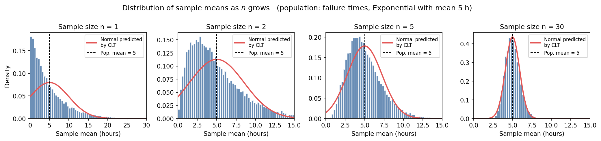

# 🛠️ Worked Example: The Central Limit Theorem

In the previous section we made a careful distinction between the **population** (everything we care about - usually unmeasurable) and the **sample** (the small set of measurements we actually have). We used the sample mean $\bar{x}$ as our best guess of the unknown population mean $\mu$.

That immediately raises a worrying question:

> If I take **a different sample**, I'll get a **different** sample mean. So how trustworthy is *any one* sample mean? Could it be wildly off?

This is one of the most important questions in all of statistics - and the answer is given by the **Central Limit Theorem** (CLT). It is also one of the most surprising results in science, so it is worth slowing down to see it in action.

---

## 1. The claim

```{admonition} The Central Limit Theorem (in plain English)
:class: important
Take any population - it can have any shape at all (skewed, lumpy, discrete, ugly). Repeatedly draw samples of size $n$ from it and compute the **mean** of each sample.

As $n$ grows, the distribution of those **sample means** looks more and more like a **bell curve** (a normal distribution) - *regardless of what the original population looked like*.

Specifically, the sample means cluster around the true population mean $\mu$, with a spread that **shrinks** as $n$ grows:

$$
\text{spread of sample means} \;=\; \frac{\sigma}{\sqrt{n}}
$$

where $\sigma$ is the population standard deviation.
```

Two pieces here deserve emphasis:

1. **The shape becomes normal even when the original data isn't.** This is the magic of the CLT. The bell curve is not assumed - it *emerges*.
2. **The spread shrinks as $\sqrt{n}$.** Bigger samples give more reliable means. To halve your uncertainty, you need *four times* as much data - not twice.

We're going to see both of these happen with our own eyes.

---

## 2. The setup: failure times of a material

Suppose we are stress-testing a new ceramic and recording how many **hours each specimen lasts before it fractures**. Failure times like these are famously **right-skewed**: lots of specimens fail early, a few survive much longer. The bell-curve shape *does not apply* to the raw failure times.

For this example we'll work with a population where the **true population mean is $\mu = 5$ hours** and the **true population standard deviation is $\sigma = 5$ hours**. (These values come from a so-called *exponential* distribution - the details aren't important; what matters is that the shape looks nothing like a bell.)

```{admonition} Problem
:class: note
We are going to run a thought experiment. We will pretend to repeat the following procedure many thousands of times:

> *"Draw $n$ failure times from the population, compute their sample mean $\bar{x}$, write it down."*

This gives us a whole collection of sample means. According to the CLT, that collection should look more and more like a bell curve as $n$ grows, centred at $\mu = 5$, with spread $\sigma/\sqrt{n} = 5/\sqrt{n}$.

**Before looking at the figure**, fill in this prediction table using $\sigma/\sqrt{n}$:

| Sample size $n$ | Predicted centre of the bell | Predicted spread $\sigma/\sqrt{n}$ |
|---|---|---|
| 1   | ? | ? |
| 2   | ? | ? |
| 5   | ? | ? |
| 30  | ? | ? |
```

```{admonition} Show solution
:class: dropdown

The centre is **always $\mu = 5$ hours**, no matter what $n$ is. Only the spread changes:

| Sample size $n$ | Centre | Spread $\sigma/\sqrt{n} = 5/\sqrt{n}$ |
|---|---|---|
| 1   | 5 | $5/\sqrt{1} = 5.00$ |
| 2   | 5 | $5/\sqrt{2} \approx 3.54$ |
| 5   | 5 | $5/\sqrt{5} \approx 2.24$ |
| 30  | 5 | $5/\sqrt{30} \approx 0.91$ |

So the CLT predicts: as $n$ grows from 1 to 30, the cloud of sample means stays centred on 5 hours but **tightens** from a spread of 5 hours down to about 0.91 hours. That's a factor of roughly $\sqrt{30} \approx 5.5\times$ tighter.
```

---

## 3. Now let's actually do it

Below, each panel shows what happens when we draw 20,000 samples of size $n$, compute the mean of each, and histogram those 20,000 means. The red curve is the bell curve the CLT *predicts* - centre at 5, spread $5/\sqrt{n}$.




The distribution of sample means as the sample size $n$ grows. The underlying population (failure times) is right-skewed and looks nothing like a bell - yet by $n=30$, the distribution of sample means is essentially indistinguishable from the bell curve predicted by the CLT (red).


Look carefully at each panel:

- **$n = 1$** - A "sample of size 1" is just a single measurement, so this panel is really just showing the population itself. It is steeply right-skewed, with most failures happening early. *No bell anywhere.* In fact the red CLT-predicted bell is clearly wrong here: it even puts probability below 0 hours, which is impossible for a failure time. **Bottom line:** at $n=1$ the CLT has not "kicked in" yet.

- **$n = 2$** - Averaging just two measurements already pulls the histogram inward. It is still skewed, but a hump is appearing near 5.

- **$n = 5$** - Now the shape is recognisably bell-ish, peaked at the population mean of 5, with only a faint right-skew remaining. The red CLT prediction is a noticeably better fit.

- **$n = 30$** - The histogram and the red curve are **on top of each other**. The CLT is now an excellent description of how sample means behave, even though the underlying data is wildly non-normal.

```{admonition} Verifying the prediction numerically
:class: tip
Comparing what we *predicted* with $\sigma/\sqrt{n}$ to what the simulation *actually produced*:

| $n$ | Predicted spread | Observed spread of sample means |
|---|---|---|
| 1  | 5.00 | 5.04 |
| 2  | 3.54 | 3.54 |
| 5  | 2.24 | 2.24 |
| 30 | 0.91 | 0.92 |

The CLT formula is not approximate hand-waving - it nails the spread of the sample means to within a fraction of a percent. *(These observed values come from the simulation that produced the figure above.)*


---

## 4. The "n is large enough" rule of thumb

A natural question: **how large does $n$ have to be** before the bell curve is a good approximation?

There is no exact answer - it depends on how non-normal the population is. A common rule of thumb you will see in textbooks is:

> **If $n \geq 30$, the distribution of the sample mean is usually close enough to normal for practical purposes.**

This is a guideline, not a law. If the population is *already* roughly bell-shaped, much smaller $n$ is fine. If the population is *extremely* skewed or has heavy tails, you may need much more than 30. In our exponential example, $n=30$ already does a great job, as the figure shows.

---

## 5. Why this is so useful: the standard error of the mean

The CLT gives us a name and a formula for the spread of the sample mean. We call it the **standard error of the mean**:

$$
\text{SE}(\bar{x}) \;=\; \frac{\sigma}{\sqrt{n}}
$$

This is the quantity that tells us *how uncertain our sample mean is as an estimate of the true population mean.*

```{admonition} Problem
:class: note
You measure the failure times of $n = 25$ ceramic specimens and find a sample mean of $\bar{x} = 4.6$ hours. Assume the population standard deviation is known to be $\sigma = 5$ hours.

What is the standard error of your sample mean?
```

```{admonition} Show solution
:class: dropdown

$$
\text{SE}(\bar{x}) = \frac{\sigma}{\sqrt{n}} = \frac{5}{\sqrt{25}} = \frac{5}{5} = 1 \ \text{hour}
$$

So although our best estimate of the population mean is 4.6 hours, we know that this estimate has a typical uncertainty of about **1 hour**. Because the CLT tells us $\bar{x}$ is approximately normally distributed around $\mu$, we can even say something stronger:

- about **68%** of the time, $\bar{x}$ falls within 1 SE of $\mu$ → $\mu$ is likely within roughly $4.6 \pm 1$ hour
- about **95%** of the time, within 2 SE → $\mu$ is likely within roughly $4.6 \pm 2$ hours

This is the engine behind **confidence intervals**, which we'll meet shortly.
```

```{admonition} The square-root law in practice
:class: warning
Because SE shrinks as $\sigma/\sqrt{n}$, **doubling your precision requires quadrupling your sample size**.

- Going from $n=25$ to $n=100$ → halves the SE (5 → 2.5… wait, $5/\sqrt{25}=1$ and $5/\sqrt{100}=0.5$, so SE goes from 1 to 0.5). ✓
- Going from $n=100$ to $n=10000$ → reduces SE by a factor of 10.

There is no cheap way around this. The CLT is *generous* (it works on any population) but *strict* about the price of precision.
```

---

## 6. Why this matters for machine learning

The CLT is the reason a lot of machine learning *works*:

- **Training metrics are sample means.** When we report a model's "accuracy on the test set" or "mean squared error", we are reporting a sample mean. The CLT tells us how uncertain that number is - and how much test data we need before we can trust it.
- **Comparing two models** boils down to comparing two sample means. The CLT lets us judge whether the difference is real or just sampling noise.
- **Cross-validation** averages performance across folds. The CLT explains why averaging stabilises the estimate.
- **Standard error bars** on every plot you'll ever see in an ML paper are an application of $\sigma/\sqrt{n}$.

Whenever you see error bars, confidence intervals, or "is this improvement statistically significant?", the CLT is quietly doing the work in the background.

---

## 7. Summary

```{admonition} What to remember
:class: important
- **What the CLT says:** sample means become **normally distributed** as $n$ grows, *regardless of the shape of the underlying population*.
- **Centre:** the population mean $\mu$.
- **Spread:** the **standard error**, $\sigma/\sqrt{n}$.
- **Rule of thumb:** $n \geq 30$ is usually enough.
- **The price of precision:** to halve the SE, you need **4×** the data.
- **Why we care:** the CLT is what makes a single sample mean *trustworthy* as a stand-in for the unknown population mean - and it's the foundation of confidence intervals, hypothesis tests, and most uncertainty quantification you'll see in ML.
```

---

## 8. Reproduce it yourself (optional)

If you want to play with the simulation - try a different population shape, a different sample size, or a different number of repeats - the entire figure can be reproduced with a short Python snippet:

```{code-cell} python3
import numpy as np
import matplotlib.pyplot as plt

rng = np.random.default_rng(seed=7)

# A non-normal population: failure times (hours), exponentially distributed
beta = 5.0
population = rng.exponential(scale=beta, size=500_000)

fig, axes = plt.subplots(1, 4, figsize=(14, 3.3))
for ax, n in zip(axes, [1, 2, 5, 30]):
    # Repeatedly draw a sample of size n, compute its mean, 20000 times
    sample_means = rng.choice(population, size=(20_000, n), replace=True).mean(axis=1)

    xmax = 30 if n == 1 else 15
    ax.hist(sample_means, bins=60, density=True, range=(0, xmax),
            color="#4C78A8", edgecolor="white", alpha=0.85)

    # Overlay the bell curve the CLT predicts
    se = beta / np.sqrt(n)
    xs = np.linspace(0, xmax, 400)
    pdf = (1/(se*np.sqrt(2*np.pi))) * np.exp(-0.5*((xs - beta)/se)**2)
    ax.plot(xs, pdf, color="#E45756", lw=2)

    ax.axvline(beta, color="black", linestyle="--", linewidth=1)
    ax.set_title(f"n = {n}")
    ax.set_xlabel("Sample mean (hours)")

plt.tight_layout()
plt.show()
```

```{admonition} Try this
:class: tip
- Change the source distribution from `rng.exponential` to `rng.uniform(0, 10)` - does it still become bell-shaped?
- Try a really skewed one: `rng.lognormal(mean=0, sigma=1, size=500_000)`. How large does $n$ need to be before the histogram looks normal?
- What happens if you try $n = 100$ or $n = 1000$?
```
