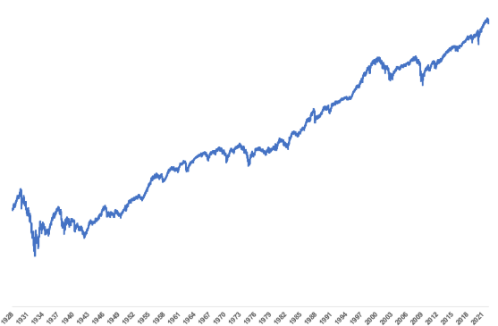
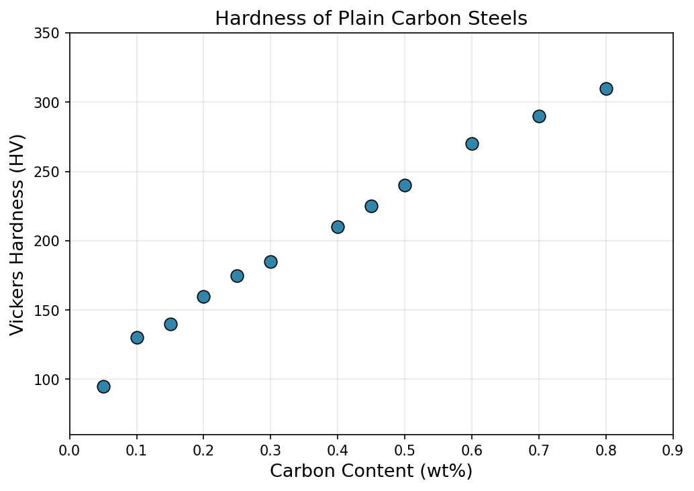
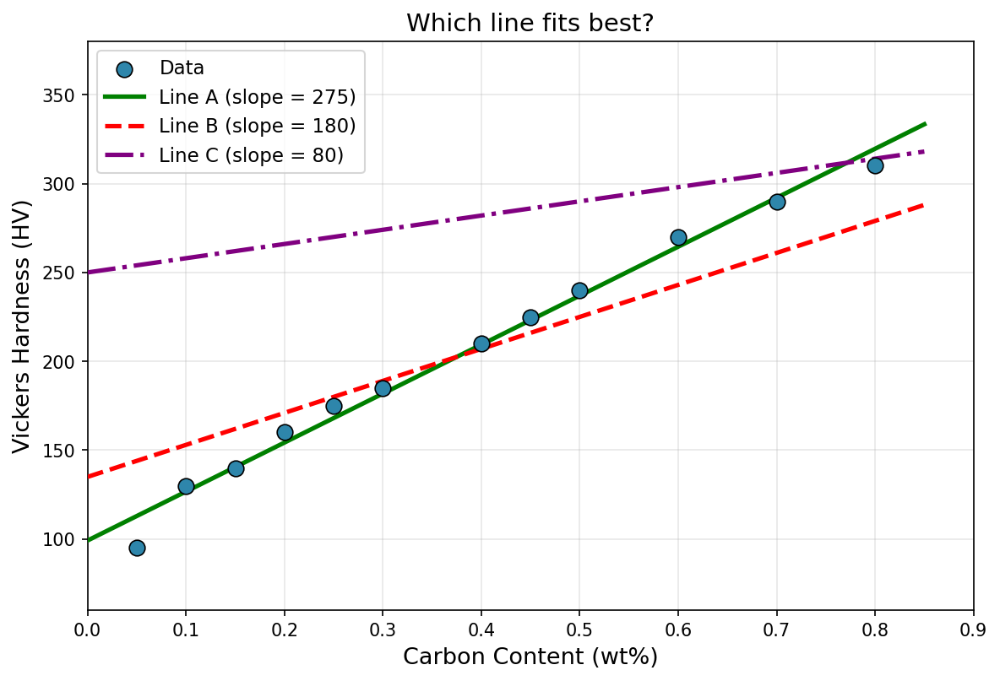

# Week 3 — What to expect 🤔

Inferential statistics is the branch of statistics that deals with drawing conclusions about a larger group based on a smaller sample of data. It also covers making future predictions based on current data. Everyday examples include predicting election outcomes from polls, estimating the effectiveness of a new drug from clinical trials, and forecasting population growth from census samples.

But before we can predict what comes next, we need to know the relationship between the variables of the current data.
p

So, the next lecture is all about Finding the Best Line between two or more variables.

Before we get into any equations, let's start with a question.

## A Simple Dataset

The table below shows the **carbon content** (in weight %) and **Vickers hardness** (HV) of 12 plain carbon steel samples.

| Sample | Carbon Content (wt%) | Hardness (HV) |
|--------|---------------------|----------------|
| 1      | 0.05                | 95             |
| 2      | 0.10                | 130            |
| 3      | 0.15                | 140            |
| 4      | 0.20                | 160            |
| 5      | 0.25                | 175            |
| 6      | 0.30                | 185            |
| 7      | 0.40                | 210            |
| 8      | 0.45                | 225            |
| 9      | 0.50                | 240            |
| 10     | 0.60                | 270            |
| 11     | 0.70                | 290            |
| 12     | 0.80                | 310            |

This is a well-known relationship in metallurgy - as carbon content increases, the steel generally gets harder. But let's set aside *why* that happens and focus on the data itself.

## The Scatter Plot

Here's what the data looks like when we plot it:

Vickers hardness of plain carbon steel samples as a function of carbon content.

## Your Turn 🤔

Take a moment to think about the following three possibilites (green,red, purple):

:::{admonition} Think About It 🤔🤔
:class: tip

1. If you had to draw a **single straight line** through this data, which one would it be - red, green or purple?

2. Is there a "correct" line, or could multiple lines work equally well?

3. How would you decide whether your line is **better or worse** than the other lines? - What is the mathematical criteria?

4. If a new steel sample has **0.35 wt% carbon**, what hardness would you *guess* from your line?
:::

There is no single obvious answer to question 3 - and that's the point. We need a way to *measure* how good a line is. That's what the next section is about.

:::{admonition} 📢 Words to listen for
:class: note

The following terms will come up frequently in the next few lectures. You don't need to memorise them now — just be aware that they exist:

- **Line of best fit** — a line that best represents the trend in the data
- **Residual** — the vertical distance between a data point and the line
- **Least squares** — a method for finding the "best" line by minimising the total squared residuals
- **Slope** and **intercept** — the two numbers that define a straight line ($y = mx + c$)
- **Prediction** — using the line to estimate a value you haven't measured
:::

**🐍 Python**

We will be using the Linear Regression class from the Sci-kit learn package

([Linear Regression](https://scikit-learn.org/stable/modules/generated/sklearn.linear_model.LinearRegression.html))

and later extending it into the [Polynomial functions](
https://scikit-learn.org/stable/modules/generated/sklearn.preprocessing.PolynomialFeatures.html)

:::{note}
Linear Regression is implemented in python using Linear algebra which you encountered in lecture 1. Mathematically it also relies on Calculus. If you intend to further your understanding of machine learning, it is advisable to spend some time on both as they are fundamental in the understanding of both classical and deep learning. However, for the purpose of this course these are 'under the hood' mechanisms which you can go without a deeper understanding.  
:::

:::{admonition} By the end of this lesson you should be able to
:class: tip
- Explain what a "line of best fit" is and why we need a systematic method to find one
- Use the least squares method to fit a straight line to a dataset
- Interpret the slope and intercept of a linear regression model in the context of a materials problem
- Recognise when a linear model is not sufficient and extend the approach to polynomial regression
- Evaluate how well a regression model fits the data using residuals and R² score
:::