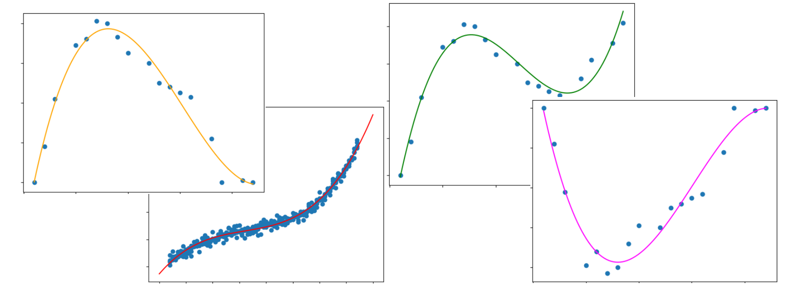

## From Straight Lines to Curves ➰ 

So far, our model has been a simple straight line:

$$
y = a_0 + a_1 x
$$

It did a lovely job on the hardness-versus-strength data, because that relationship really is roughly a straight line. But out in the wild, data loves to *curve*. 




So how do we let our model bend? We give it some curves to work with. Enter **polynomial regression**. 🎢

## Polynomial Regression

The idea is delightfully simple: we keep our straight-line equation and just add on higher powers of $x$.

$$
y = a_0 + a_1 x + a_2 x^2 + a_3 x^3 + \dots + a_n x^n
$$

or, written compactly:

$$
y = \sum_{i=0}^{n} a_i \, x^i
$$

Each new term hands the curve extra freedom to bend. Add an $x^2$ term and it can form a single gentle hump or valley; add $x^3$ and it can wiggle up-then-down; keep going and it can trace increasingly wavy shapes to hug your data. That's exactly what those coloured example curves are doing - same equation, just different numbers of terms and different coefficients producing humps, waves, and swoops.

```{admonition} The big secret 🤫
:class: tip
Here's the fun twist: **polynomial regression is still linear regression!**

Wait, what? It's full of $x^2$ and $x^3$ terms - how is that linear?

The trick is *what* we're being linear in. The model is linear in its **coefficients** ($a_0, a_1, a_2, \dots$), even though it's curvy in $x$. And the coefficients are the things we're actually solving for. So from the model's point of view, $x^2$ and $x^3$ are just... more input columns. We treat "$x$", "$x$ squared", "$x$ cubed" as separate features, and fit a good old linear model on top of them.

That means we get to reuse *everything* we already learned - no new fitting method required. Sneaky, right?
```

## Degree of a Polynomial

The **degree** of a polynomial is simply its highest power of $x$. That single number tells you how flexible the curve is allowed to be:

- $y = a_0 + a_1 x$ &nbsp;→&nbsp; degree **1** (our familiar straight line)
- $y = a_0 + a_1 x + a_2 x^2$ &nbsp;→&nbsp; degree **2** (one bend — a parabola)
- $y = a_0 + a_1 x + a_2 x^2 + a_3 x^3$ &nbsp;→&nbsp; degree **3** (room for two bends)

The pattern keeps going. A degree-5 polynomial, for example, *can* include the terms

$$
x^5,\ x^4,\ x^3,\ x^2,\ x,\ a_0 \ (\text{the constant})
$$

The numerical values sitting in front of each term - the $a_i$'s - are called the **coefficients** of the polynomial. They're the knobs the model turns to shape the curve, and they're precisely what our fitting step will figure out for us.

```{admonition} A tiny gotcha with degree
:class: note
The degree is set by the *highest power that's actually present*, i.e. whose coefficient isn't zero. For instance:

$$
y = 3 + \tfrac{5}{2}x + 21x^2 - 11x^3 + 0\,x^4 + 1\,x^5 \;\;\longrightarrow\;\; y = 3 + \tfrac{5}{2}x + 21x^2 - 11x^3 + 1\,x^5
$$

The x4 term quietly vanishes because its coefficient is 0 - but the polynomial is still **degree 5**, because that x5 term is alive and well at the top.
```

## Polynomial, Deconstructed into a Matrix 🔢

Now for the neat part that connects everything back to the matrix picture. We can rewrite the whole polynomial as a single multiplication of two pieces:

$$
y =
\underbrace{\begin{bmatrix} a_0 & a_1 & a_2 & \cdots & a_n \end{bmatrix}}_{\text{coefficient vector}}
\;
\underbrace{\begin{bmatrix} 1 \ x \ x^2 \ \vdots \ x^n \end{bmatrix}}_{\text{feature vector}}
$$

Read left to right, this just says "multiply each coefficient by its matching power of $x$ and add them all up" - which is exactly our polynomial. But splitting it this way makes something click:

- The **feature vector** on the right is our *engineered features*: we took a single input $x$ and expanded it into $1, x, x^2, \dots, x^n$.
- The **coefficient vector** on the left is the set of numbers we're solving for - same role the slope and intercept played for the straight line, just more of them.

```{admonition} Why this is genuinely great news 🎉
:class: tip
Remember the design matrix and the normal equation from our earlier maths detour? This is where they pay off.

Stack the feature vector for *every* specimen into rows, and you get a design matrix X - one column for each power of x. Then finding the best coefficients is the **exact same** least-squares problem as before:

$$
\boldsymbol{\beta} = (\mathbf{X}^T\mathbf{X})^{-1}\mathbf{X}^T\mathbf{y}
$$

Straight line, quadratic, degree-5 curve - under the hood it's all the same solve. We only changed what we put *into* X. So learning linear regression well really did buy us polynomial regression for free.
```

## A gentle word of caution (for later) 

It's tempting to think "more degree = more flexible = better fit = ", and tuning the degree way up will indeed let the curve thread through nearly every point. But a curve that contorts itself to hit every training point often does a *worse* job on new, unseen data - it starts memorising the noise instead of learning the trend. There's a real sweet spot to find.

```{admonition} Callback: interpolation vs extrapolation
:class: warning
Remember interpolation (predicting *inside* your data range) versus extrapolation (predicting *outside* it)? High-degree polynomials are especially dramatic here - just past the edge of your data, they can shoot off toward the sky or the floor almost immediately. 😬 So the "curve everywhere" superpower comes with a "handle with care" label, particularly near the boundaries.
```

We'll dig into how to pick a sensible degree - and how to spot a model that's over-eager - in a later session. For now, the headline is a happy one: our trusty linear regression stretches effortlessly into curves, and it's the very same idea underneath. 🙌
